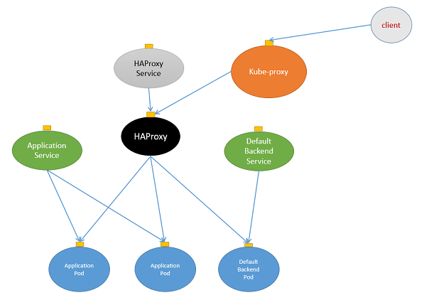

# Ingress
In kubernetes, user applications are made public by creating a service on a given port and a load balancer on top of the cluster for each application to expose. For example, a request for *https://myservice.mysite.com:443* will be balanced across worker nodes and then routed to the related service exposed on a given port by the kube proxy. An external load balancer is required for each service to expose. This can get rather expensive especially when on a public cloud.

Ingress gives the cluster admin a different way to route requests to services by centralizing multiple services into a single external load balancer. An ingress is split up into two main pieces: the first is an **Ingress Resource**, which defines how you want requests routed to the backing services. The second is an **Ingress Controller**, which listen to the kubernetes API for Ingress Resource creation and then handle requests that match them. Ingress Controllers can technically be any system capable of reverse proxying, but the most common options are Nginx and HAProxy. As additional component, a **Default Backend** service can be used to handle all requests that are no service relates, eg. *Not Found (404)* error page.

## Ingress Resource
An ingress resource is a kubernetes abstraction to handle requests, for example, *http://www.mysite.com* and *http://blog.mysite.com* and then route them to the kubernetes services named website and blog respectively.

A file definition ``mysite-ingress.yaml`` for the Ingress resource above looks like the following

```yaml
apiVersion: extensions/v1beta1
kind: Ingress
metadata:
  name: noverit.com
spec:
  rules:
  - host: web.noverit.com
    http:
      paths:
      - path: /
        backend:
          serviceName: website
          servicePort: 80

  - host: blog.noverit.com
    http:
      paths:
      - path: /
        backend:
          serviceName: blog
          servicePort: 80
```

Before to create an Ingress, define a simple web server application listening on http port, as in the following ``mysite.yaml`` configuration file

```yaml
apiVersion: v1
kind: ReplicationController
metadata:
  name: mysite
spec:
  replicas: 3
  template:
    metadata:
      labels:
        app: mysite
    spec:
      containers:
      - name: mysite
        image: gcr.io/google_containers/echoserver:1.8
        ports:
        - containerPort: 8080
        env:
          - name: NODE_NAME
            valueFrom:
              fieldRef:
                fieldPath: spec.nodeName
          - name: POD_NAME
            valueFrom:
              fieldRef:
                fieldPath: metadata.name
          - name: POD_NAMESPACE
            valueFrom:
              fieldRef:
                fieldPath: metadata.namespace
          - name: POD_IP
            valueFrom:
              fieldRef:
                fieldPath: status.podIP
```

Create the application as replica controller
```bash
kubectl create -f mysite.yaml
```

Then define two different internal services pointing to the same application above, as in the ``mysite-svc.yaml`` configuration file
```yaml
apiVersion: v1
kind: Service
metadata:
  name: website
  labels:
    app: website
spec:
  type: ClusterIP
  ports:
  - port: 80
    targetPort: 8080
    protocol: TCP
    name: website
  selector:
    app: mysite

---
apiVersion: v1
kind: Service
metadata:
  name: blog
  labels:
    app: blog
spec:
  type: ClusterIP
  ports:
  - port: 80
    targetPort: 8080
    protocol: TCP
    name: blog
  selector:
    app: mysite
```

Please, note the services above are defined as type of ``ClusterIP`` and then they are not exposed to the external. This is required since the Ingress will configure the cluster to route requests to the services without passing through the kube proxy. 

Create the services
```bash
kubectl create -f mysite-svc.yaml
```

Create the ingress
```bash
kubectl create -f mysite-ingress.yaml
```

Check and inspect the ingress
```bash
kubectl get ingress -o wide
NAME          HOSTS                              ADDRESS   PORTS     AGE
noverit.com   web.noverit.com,blog.noverit.com             80        24m
```

However, an Ingress resource on it’s own does not do anything. An Ingress Controller is required to route requests to the service.

## Ingress Controller
The Ingress Controller is the component that routes the requests to the services. It is listening to the kubernetes API for an ingress creation and then handle requests. Ingress Controllers can technically be any system capable of reverse proxying, but the most common options are Nginx and HAProxy.

Before to create an Ingress Controller, we are going to create a default backend service for the Ingress Controller itself. This backend service will reply to all requests that are not related to our services, for example requests for unknown url.

### Default Backend
Create the backend and related service from the file ``ingress-default-backend.yaml`` available [here](../examples/ingress-default-backend.yaml)
```bash
kubectl create -f ingress-default-backend.yaml
```

The template above, will create a replica controller and the related internal service in the ``kube-system`` namespace.
```bash
kubectl get all -l run=ingress-default-backend
NAME                               READY     STATUS    RESTARTS   AGE
po/ingress-default-backend-hd5pv   1/1       Running   0          1m

NAME                         DESIRED   CURRENT   READY     AGE
rc/ingress-default-backend   1         1         1         1m

NAME                          CLUSTER-IP      EXTERNAL-IP   PORT(S)    AGE
svc/ingress-default-backend   10.32.156.148   <none>        8080/TCP   1m
```

Please, note that the ingress default backend service is an internal service ``type: ClusterIP`` and therefore, it is not exposed.

### HAProxy as Ingress Controller
THe HAProxy is capable to act as reverse proxy to route requests from an external load balancer directly to the pods providing the service. To configure an HAProxy Ingress Controller, create first an HAProxy deploy form the ``haproxy-ingress-controller-deploy.yaml`` available [here](../examples/haproxy-ingress-controller-deploy.yaml) and then the related service from the file ``haproxy-ingress-controller-svc.yaml`` available [here](../examples/haproxy-ingress-controller-svc.yaml).

Create the deploy and the service
```bash
kubectl create -f haproxy-ingress-controller-deploy.yaml
kubectl create -f haproxy-ingress-controller-svc.yaml
```

The templates above, will create a deploy and the related service in the ``kube-system`` namespace.
```bash
kubectl get all -l run=haproxy-ingress-controller
NAME                                             READY     STATUS    RESTARTS   AGE
po/haproxy-ingress-controller-4130110709-2lzbv   1/1       Running   0          19s

NAME                             CLUSTER-IP      EXTERNAL-IP   PORT(S)          AGE
svc/haproxy-ingress-controller   10.32.245.104   <nodes>       80:30080/TCP..   4h

NAME                                DESIRED   CURRENT   UP-TO-DATE   AVAILABLE  AGE
deploy/haproxy-ingress-controller   1         1         1            1          4h

NAME                                       DESIRED   CURRENT   READY            AGE
rs/haproxy-ingress-controller-4130110709   1         1         1                4h
```

Please, note that the ingress controller service is exposed service ``type: NodePort`` and therefore, it is accessible through the kube proxy.

The network layout created by an Ingress Controller is reported in the following




